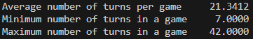
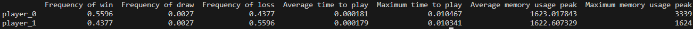

# Stratégie de test

## 1. Introduction

Le package offre différents outils pour permettre de tester facilement et systématiquement les agents. Plus particulièrement, les tests réalisables sont catégorisables selon deux groupes :
- les tests stratégiques : des tests permettant de déterminer si un agent donné joue un des coups attendus dans un état de jeu donné;
- les tests de performances : des tests permettant de déterminer si un agent est meilleur qu'un autre et vérifie les contraintes de la compétion sur ML-Arena. 

Les principaux outils du module ont été testés dans le fichier `test_game_facilities.py` à l'aide de situations standardisées simples. Rappelons également que les tests du package sont a éxécuter à la racine de ce dernier à l'aide du module `pytest`.

## 2. Les tests stratégiques

Pour tester l'habileté stratégique des agents, le package offre essentiellement deux fonctionnalités dans le module `game_facilities.py`.

La première est la fonction `testing_strategy` d'arguments  
`(action_list, CustomAgent, expected_action_list)` 
 
où `action_list` est une liste contenant les actions à jouer pour obtenir un état donné du jeu, `CustomAgent` la classe d'agent à tester et `expected_action_list` une liste contenant les possibilités d'actions voulues pour le prochain coup de l'agent. La fonction fait alors jouer l'agent dans un environnement avec `seed=42` et renvoie `True` si l'agent a effectivement joué l'un des coups de `expected_action_list`, et `False` sinon.

La deuxième fonctionnalité est une collection de listes d'actions prédéfinies et utilisables avec `testing_strategy`. Elles permettent notamment de tester facilement des situations où l'agent doit jouer pour obtenir la victoire, ou alors bloquer l'adversaire pour ne pas perdre au prochain tour. Leurs noms ainsi que les états de jeu qu'elles représentent sont disponibles dans [l'annexe](annex.md#top) du package. Elles sont également disponibles à la toute fin du fichier `game_facilities.py`.

## 3. Les tests de performances

Pour tester les performances des agents, le package offre là-aussi essentiellement deux fonctionnalités dans le module `game_facilities.py`.

La première est la fonction `connect4_game_with_history` d'arguments :   
`(num_games, Custom_Agent0, Custom_Agent1, seed_option=42, is_testing=False)` 
 
où `num_games` est le nombre de parties à jouer, `CustomAgent0` la classe de l'agent jouant en premier, `CustomAgent1` celle de l'agent jouant en second, `seed_option` règle la `seed` de l'environnement de jeu et `is_testing` est un booléen permettant d'enclencher le mode de test de la fonction (voir `test_game_facilities.py`). La fonction fait alors jouer les deux agents l'un contre l'autre et renvoie un `tuple` de la forme `(win, draw, loss)`. `win`, `draw` et `loss` sont alors eux-mêmes des tuples contenant les `tuples` d'actions correspondants aux parties respectivement gagnées, donnant égalité, et perdues de `CustomAgent0`. Par exemple, `win[0]` représente le `tuple` donnant l'ensemble des actions jouées pendant la première partie gagné de `CustomAgent0`, `win[1]` celles de la deuxième, etc.

La deuxième fonctionnalité est la fonction `connect4_game_with_stats` d'arguments :   
`(num_games, Custom_Agent0, Custom_Agent1, seed_option=42, is_testing=False)` 
 
Les arguments représentent la même chose que pour `connect4_game_with_history`. En revanche, la fonction retourne ici un `tuple` de la forme `(turn_stats, agent_stats)` où :
- `turn_stats` est une `Series` de la librairie `Pandas` de la forme :
  
  
- `agent_stats` est un `dataframe` de la librairie `Pandas` de la forme :
  
  
où `player0` représente l'agent `CustomAgent0` jouant en premier, `player1` l'agent `CustomAgent1` jouant en second et où l'unité de temps est la seconde, l'unité de mémoire le byte. 

## 4. Tester un agent

La stratégie de test d'un agent se décompose ainsi en deux principales étapes :
- les test stratégiques : les tests sur l'ordre des priorités stratégiques de l'agent, des tests plus poussés sur une stratégie précise dans un ensemble de configurations plus large à l'aide de `testing_strategy`, des listes d'actions prédéféfinies ou de nouvelles ;
- les tests de performances : on fait jouer l'agent (en premier et en second) contre d'autres agents, notamment ceux censés être plus faibles, et l'on regarde systématiquement son taux de victoires et d'égalités, le temps maximum qu'il met pour jouer ainsi que la mémoire maximale utilisée pour jouer afin de tester son éventuelle supériorité et son respect des contraintes de la compétition ML-Arena. L'utilisation de `connect4_game_with_stats` avec un nombre suffisamment grand de parties (par exemple 1000) pour la significativité statistique est ainsi tout indiquée. 

Un exemple complet d'une telle procédure est donné par le fichier `test_smart_agent.py`. 

En cas d'échecs des tests ou de performances insatisfaisantes, la fonction `connect4_game_with_history` peut alors être utilisée pour récolter des parties afin de mener leur analyse et aider à décrypter les comportements de l'agent. Mentionnons  également la fonction `print_board` permettant d'afficher ou de stocker sous forme d'une `string` à partir du dictionnaire `observation` de l'environnement l'état du plateau de jeu. Celle-ci peut faciliter la visualisation des parties (voir `game_facilities.py` pour plus de détails). 
